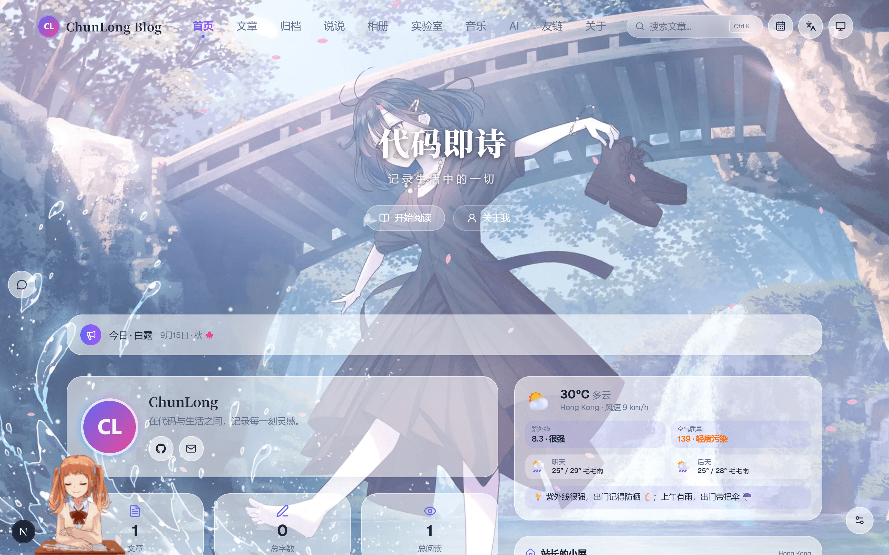
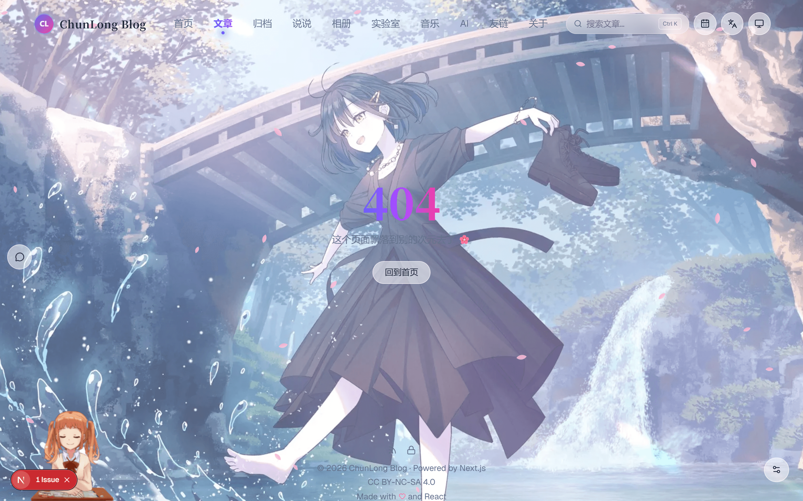
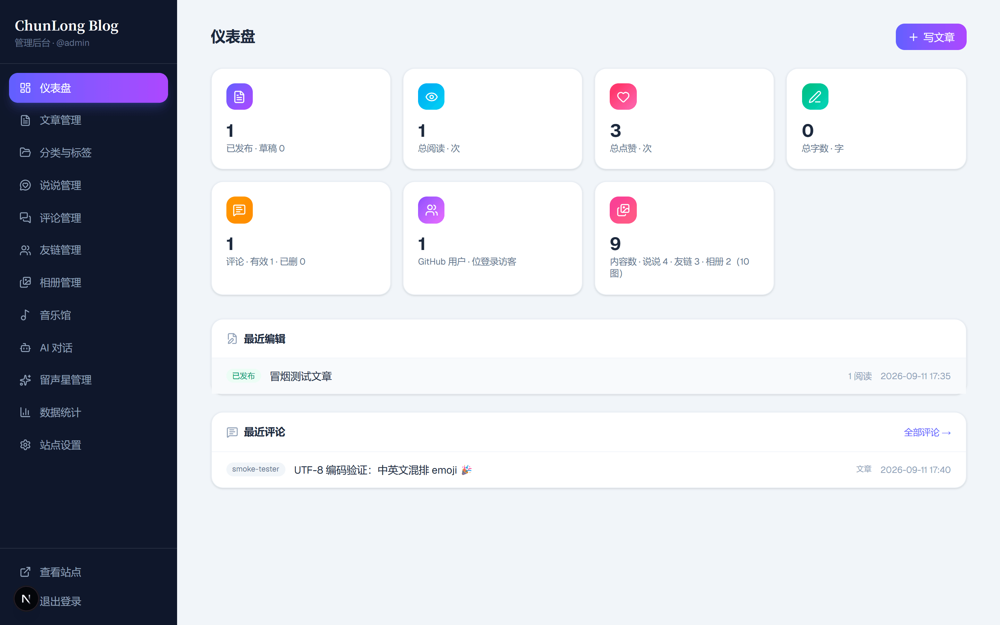
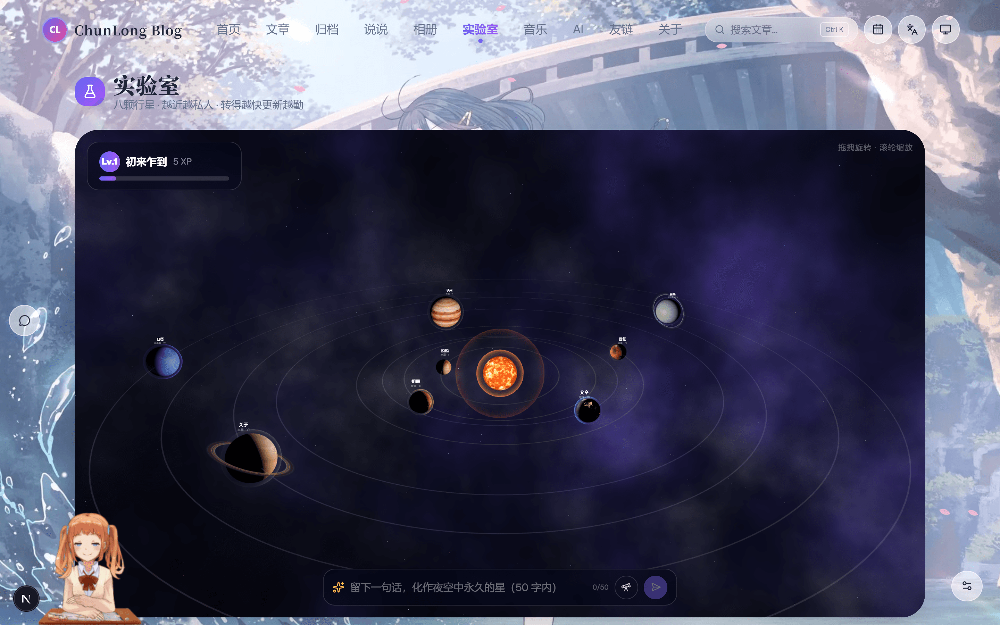

# ChunLong Blog

[](./LICENSE)
[](https://nextjs.org)
[](https://nodejs.org)
[](https://github.com/yyuu23/ChunLongBlogs/actions/workflows/ci.yml)

一个 Next.js 全栈个人博客：**前台展示 + 内置管理后台 + AI 助手**，SQLite 单文件数据库、零外部服务依赖，clone 下来五条命令就能跑成自己的站。



| 文章页 | 管理后台 | 实验室 |
|:---:|:---:|:---:|
|  |  |  |

## 功能特性

### 前台站点

- **首页**：Banner 轮播、资料卡、节气公告、天气卡、最新文章、相册海报卡
- **文章**：列表双视图 / 分类标签筛选 / 分页；详情页 Shiki 代码高亮、KaTeX 数学公式、提示框、目录、阅读进度条
- **原生评论 + 点赞**：GitHub OAuth 访客登录（游客也能点赞），点赞用户以朋友圈式头像列表展示；说说与文章共用一套评论系统
- **说说 / 相册 / 归档 / 友链 / 关于**：拍立得照片墙 + 灯箱、时间线归档
- **音乐馆** + 底部全局播放器：跨页不断播、网易云歌单一键导入、最近播放
- **AI 聊天助手**：多模型（DeepSeek / GLM / Qwen）、思考强度、博客内容问答（RAG）、联网搜索、访客积分体系
- **实验室 `/lab`**：three.js 星海 + 可交互发光晶体
- **四语言**：中文 / English / 日本語 / 한국어
- RSS、sitemap、站内搜索、动态 OG 图

### 华丽体验

五套主题色全站换装（代码块配色跟随）、亮樱/暗萤/落叶/落雪粒子（含季节自动档）、点击爆破、文字选中星光、Logo 七连击彩蛋、开场启动屏、页面过渡、滚动渐入、3D 倾斜卡片、导航日历、移动端底部 Tab、**Live2D 看板娘**。

### 管理后台 `/admin`

仪表盘；文章管理（CodeMirror 实时预览 + **AI 写作辅助**：润色 / 起标题 / 推荐 slug 标签 / 生成摘要）；分类标签；说说；**评论管理**（审核 / 软删除 / 恢复）；友链；相册；音乐；数据统计（含点赞 / 评论指标，可导出报告）；站点设置（站名 / 作者 / 社交链接 / 横幅 / 关于页 / ICP 备案号 / CC 协议，**大部分身份信息在这里在线改，不用动代码**）；AI 模型配置；数据导出 / 导入备份。

## 技术栈

| 类别 | 选型 |
| --- | --- |
| 框架 | Next.js 16（App Router）· React 19 · TypeScript |
| 样式动效 | Tailwind CSS v4 · framer-motion · lucide-react |
| 数据库 | SQLite（better-sqlite3）+ Drizzle ORM —— 无需安装数据库服务 |
| 认证 | jose JWT 双会话：管理员账密（bcryptjs）+ GitHub 访客 OAuth |
| Markdown | unified/remark/rehype · Shiki 高亮 · KaTeX · rehype-pretty-code |
| 3D / 视觉 | three.js + @react-three/fiber/drei · pixi.js + Live2D 看板娘 |
| 编辑器 | @uiw/react-codemirror（后台写作） |
| 图片 | sharp（上传压缩，输出 AVIF/WebP） |
| 测试 | vitest |

## 快速开始

前置要求：**Node.js ≥ 22**、npm。

```bash
git clone https://github.com/yyuu23/ChunLongBlogs.git
cd ChunLongBlogs
npm install
cp .env.example .env        # 修改 ADMIN_PASSWORD，并生成 AUTH_SECRET（文件内有命令）
npm run db:push             # 建表
npm run db:seed             # 可选：演示数据（文章/说说/相册/友链；仅限全新空库，会清空内容表）
npm run dev                 # http://localhost:3000
```

后台入口 `http://localhost:3000/admin/login`，账号密码即 `.env` 里的 `ADMIN_USERNAME` / `ADMIN_PASSWORD`。

### 环境变量

| 变量 | 必填 | 说明 |
| --- | :-: | --- |
| `ADMIN_USERNAME` / `ADMIN_PASSWORD` | ✅ | 管理员账密（首次部署自动写入数据库） |
| `AUTH_SECRET` | ✅ | JWT 签名密钥，生产必须换随机长串 |
| `SITE_URL` | ✅ | 站点对外地址（RSS / SEO） |
| `DATABASE_PATH` | ✅ | SQLite 文件路径，默认 `data/db.sqlite` |
| `GITHUB_CLIENT_ID` / `GITHUB_CLIENT_SECRET` | — | GitHub 访客登录；**留空则登录/评论入口自动隐藏**，游客点赞仍可用 |
| `DEEPSEEK_API_KEY` / `GLM_API_KEY` / `QWEN_API_KEY`（及对应 `*_BASE` / `*_MODEL`） | — | AI 助手，任意一家即可；也可用 `LLM_BASE_URL` / `LLM_API_KEY` / `LLM_MODEL` 接任意 OpenAI 兼容服务 |
| `SEARCH_API_KEY` 或 `TAVILY_API_KEY` | — | AI 助手联网搜索工具 |
| `EMBEDDING_API_KEY` / `EMBEDDING_BASE_URL` / `EMBEDDING_MODEL` | — | 博客问答语义检索（不配自动退回关键词检索） |
| `CHAT_RATE_LIMIT` / `CHAT_DAILY_LIMIT` | — | 聊天成本护栏 |

完整注释见 [.env.example](./.env.example)。

## 换成自己的站（个性化指南）

1. **进后台改**：站名、作者、社交链接、关于页、横幅、页脚、ICP 备案号、CC 协议、看板娘/AI 人设——都在 `/admin/settings` 在线修改，存数据库，不用动代码。
2. **改代码里的兜底默认值**（新库首次启动、后台未配置时生效）：

| 位置 | 内容 |
| --- | --- |
| [src/lib/site.ts](./src/lib/site.ts) | 站名、作者名、GitHub 主页、联系邮箱、横幅问候、关于页默认文案、GLM 预设描述（`DEFAULT_SITE_CONFIG`） |
| [src/components/lab/planetConfig.ts](./src/components/lab/planetConfig.ts) | 实验室"项目"星球链接 |
| [src/app/api/chat/route.ts](./src/app/api/chat/route.ts) | AI 聊天兜底人设与开源仓库提示 |
| [src/components/admin/LoginForm.tsx](./src/components/admin/LoginForm.tsx) | 登录页标题 |
| [src/lib/i18n/](./src/lib/i18n)（zh / en / ja / ko） | 四语言欢迎语 |
| [src/app/api/admin/stats/route.ts](./src/app/api/admin/stats/route.ts) | 统计导出报告标题 |
| [content/posts/](./content/posts) | `db:seed` 写入的演示文章 |

> 简单粗暴的找法：全局搜索 `ChunLong`、`yyuu23`、`2907633023` 三个关键词即可定位所有残留。

3. **换资源**：`public/assets/bg/` 背景图、`public/live2d/` 看板娘模型均可直接替换；`npm run assets` 可重新生成演示音频等占位资源。

## 部署

| 场景 | 看哪 |
| --- | --- |
| 只想本地跑起来玩 | 无需部署，见上文「快速开始」 |
| **部署到自己的服务器（从零搭建 GitHub Actions 自动部署）** | [docs/GITHUB_ACTIONS_DEPLOY.md](./docs/GITHUB_ACTIONS_DEPLOY.md) |
| 本站（chunlongblog.cn）生产环境运维手册：架构、排错、日常操作 | [docs/DEPLOYMENT.md](./docs/DEPLOYMENT.md) |

自建部署的思路：push 到 `main` → GitHub 免费云端 runner 构建 → rsync 增量上传服务器 → 自动备份数据库 → `db:push` 同步表结构 → pm2 重启 → 冒烟测试。服务器零构建压力，数据库 / 密钥 / 上传文件永不被覆盖。

## 项目结构

```
├─ src/app/(site)/       # 前台页面：首页/文章/说说/相册/归档/友链/关于/音乐馆/AI 聊天/实验室
├─ src/app/admin/        # 管理后台：仪表盘/文章/评论/统计/站点设置/AI 配置…
├─ src/app/api/          # API：评论/点赞/GitHub OAuth/AI 聊天/上传/动态 OG 图…
├─ src/components/       # 组件（admin/home/posts/effects/mascot/lab 等）
├─ src/lib/              # site.ts 站点配置 · db/schema.ts（22 张表）· auth · llm · rag · i18n
├─ content/posts/        # 种子演示文章（db:seed 读取）
├─ data/                 # SQLite 数据库（gitignore，永不入库）
├─ deploy/               # pm2 ecosystem + nginx 模板
├─ scripts/              # seed / 资源生成 / 服务器备份与部署脚本
└─ .github/workflows/    # CI（typecheck + test）+ 生产部署
```

## 开发与测试

```bash
npm run typecheck   # TypeScript 类型检查
npm test            # vitest（含评论/点赞 API 集成测试，自带临时库）
npm run assets      # 重新生成演示音频等占位资源
```

push 与 PR 会触发 [CI](./.github/workflows/ci.yml) 自动跑类型检查和测试。

## License

[MIT](./LICENSE)
